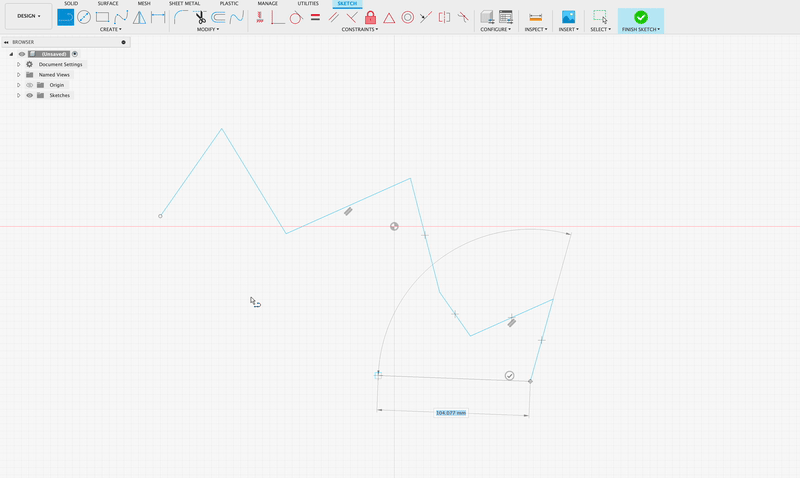

Creates a series of smooth splines from a series of lines. This treats the line
points as a Catmull-Rom spline and creates a series of cubic Bezier splines
with C1 continuity. If the lines form a loop, the splines will also form a
loop. If the lines are an open path, then the first and last segments will be
dropped as there is not the information to know their curvature.

Operates on the current selection, and after leaves all of the lines selected
so you can easily delete them. Unfortunately it does not really seem possible
to control the undo stack from Fusion scripts, so you cannot undo the entire
operation in one step, undo will undo each spline creation individually.

